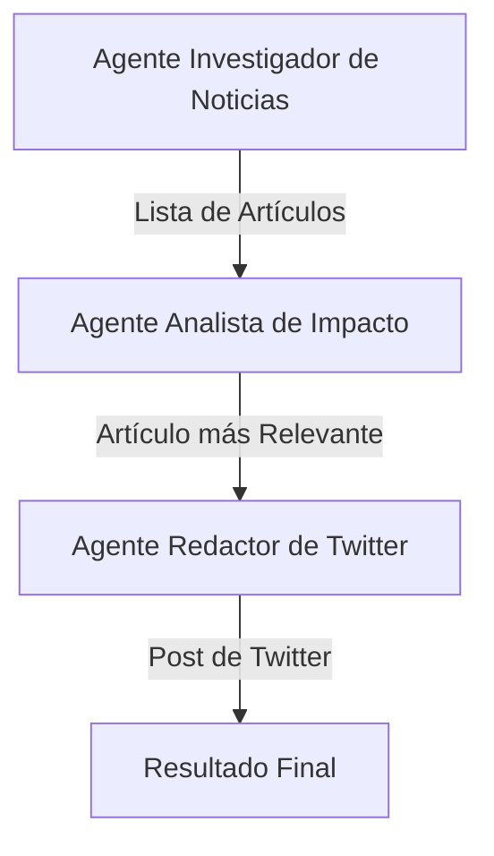

# Plan para la Herramienta de Generación de Posts de Twitter

Este documento describe el plan para crear una herramienta que genera posts de Twitter sobre el mercado automotriz en México utilizando agentes de Perplexity.

## Fase 1: Descubrimiento de Fuentes

### Tarea: Generar Lista de Fuentes de Noticias

*   **Objetivo:** Obtener una lista de 20 sitios web de noticias colombianos, priorizando aquellos con secciones de economía y negocios.
*   **Herramienta:** API de Chat de Perplexity.
*   **Prompt Sugerido:**
    ```

## Fase 2: Diseño de la Arquitectura del Pipeline

El sistema estará compuesto por un pipeline de tres agentes especializados que trabajan en secuencia.



### 1. Agente Investigador de Noticias
*   **Misión:** Encontrar los artículos de noticias más relevantes sobre el mercado automotriz en México de los últimos 5 días.
*   **Herramienta:** API de Búsqueda de Perplexity (`client.search.create`).
*   **Entrada:** Una consulta de búsqueda (ej: "precios autos nuevos México 2026") y la lista de dominios de noticias confiables.
*   **Salida:** Una lista de URLs y títulos de los artículos encontrados.

### 2. Agente Analista de Impacto
*   **Misión:** Evaluar los artículos encontrados y seleccionar el de mayor impacto.
*   **Herramienta:** API de Chat de Perplexity (`client.chat.completions.create`).
*   **Entrada:** La lista de artículos del agente anterior.
*   **Proceso:** El agente leerá el contenido de cada URL (o los resúmenes de la búsqueda) y utilizará un prompt para razonar cuál es el más significativo.
*   **Salida:** La URL y el contenido del artículo seleccionado.

### 3. Agente Redactor de Twitter
*   **Misión:** Convertir el artículo seleccionado en un post de Twitter.
*   **Herramienta:** API de Chat de Perplexity (`client.chat.completions.create`).
*   **Entrada:** El contenido del artículo seleccionado.
*   **Proceso:** Un prompt detallado guiará al agente para generar un texto conciso, añadir hashtags relevantes y mencionar la fuente.
*   **Salida:** El texto final del post de Twitter.

## Fase 3: Plan de Implementación (To-Do List)

A continuación se detallan los pasos para construir la herramienta.

- [ ] **1. Configuración del Entorno:**
    - [ ] Crear un archivo `requirements.txt` con las dependencias necesarias (ej: `perplexity-ai`).
    - [ ] Instalar las dependencias.

- [ ] **2. Implementar el Descubrimiento de Fuentes:**
    - [ ] Crear un script `get_sources.py` que utilice el prompt de la Fase 1 para generar la lista de 20 fuentes de noticias.
    - [ ] Añadir una función en `get_sources.py` para verificar que cada URL generada sea válida y esté activa (por ejemplo, haciendo una petición HEAD).
    - [ ] Guardar la lista de dominios en un archivo de texto o JSON para que el pipeline pueda usarla.

- [ ] **3. Implementar el Pipeline de Agentes:**
    - [ ] Crear un archivo principal `main.py`.
    - [ ] Implementar la lógica para el **Agente Investigador de Noticias**.
    - [ ] Implementar la lógica para el **Agente Analista de Impacto**.
    - [ ] Implementar la lógica para el **Agente Redactor de Twitter**.

- [ ] **4. Orquestar y Probar:**
    - [ ] Conectar los agentes en `main.py` para que la salida de uno sea la entrada del siguiente.
    - [ ] Ejecutar el pipeline completo.
    - [ ] Revisar el resultado y refinar los prompts o la lógica si es necesario.
    "Actúa como un experto en medios de comunicación de Colombia. Necesito una lista de 20 sitios web de noticias confiables y de alta reputación en el país. Por favor, incluye una mezcla de periódicos nacionales, revistas de negocios y portales de noticias financieras. Para cada sitio, proporciona el nombre y la URL principal (por ejemplo, El Tiempo - eltiempo.com). La lista debe estar formateada en markdown."